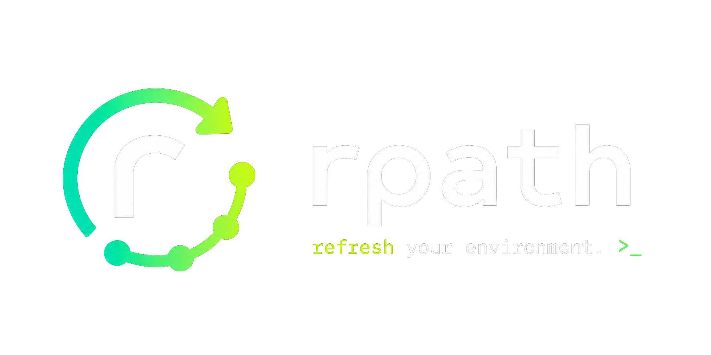

<div align="center">
</img>
</div>

# rpath

Refresh your shell environment without restarting your terminal.

`rpath` rebuilds PATH from system, user, shell, and package-manager sources,
deduplicates entries, keeps critical system paths, and emits commands that update
the current shell session through a tiny installed wrapper.

## Features

- One-command refresh after setup: `rpath`
- Cross-platform PATH planning for Windows, Linux, and macOS
- Shell emitters for PowerShell, PowerShell Core, cmd, bash, zsh, and fish
- Diagnostics for duplicates, missing entries, invalid entries, and basic risks
- Diff, repair, snapshot, restore, and environment version tracking
- Local integrations for VS Code terminals, Windows Explorer, Git Bash, and WSL
- Optional foreground watcher or user service/scheduled task
- Offline by design: no runtime network calls

## Install

Linux and macOS:

```bash
curl -fsSL https://get.rpath.dev/install.sh | sh
```

Windows PowerShell:

```powershell
irm https://get.rpath.dev/install.ps1 | iex
```

## Quick Start

Install the wrapper for your current shell:

```bash
rpath install
```

You can also be explicit when setting up a specific shell:

```bash
rpath install --shell cmd
rpath install --shell powershell
rpath install --shell pwsh
```

Restart the shell once or source your profile. From then on:

```bash
rpath
```

The wrapper evaluates `rpath --emit` under the hood, which is required because a
native child process cannot directly mutate its parent shell.

For manual use:

```bash
eval "$(rpath --emit --shell bash)"
```

PowerShell:

```powershell
Invoke-Expression (& rpath --emit --shell pwsh)
```

If PowerShell refuses to load your profile with an execution-policy error, check
the current policy:

```powershell
Get-ExecutionPolicy -List
```

For a normal per-user setup, allow local profile scripts for the current user:

```powershell
Set-ExecutionPolicy -Scope CurrentUser RemoteSigned
```

Restart PowerShell after changing the policy. This allows the local `$PROFILE`
file updated by `rpath install` to load without changing machine-wide policy.

Fish:

```fish
rpath --emit --shell fish | source
```

## Commands

```text
rpath                         Build a refresh plan
rpath --emit                  Emit shell commands for the detected shell
rpath print                   Print the computed PATH
rpath doctor [--security]     Diagnose PATH problems
rpath diff                    Show added, removed, and reordered entries
rpath repair [--emit]         Build or emit a repaired PATH
rpath snapshot save [reason]  Save the current plan
rpath snapshot list           List saved snapshots
rpath snapshot restore [id]   Restore a snapshot through emit mode
rpath snapshot delete <id>    Delete a snapshot
rpath version list            List automatically tracked versions
rpath version diff <a> <b>    Diff two tracked versions
rpath version restore <id>    Restore a tracked version through emit mode
rpath install [--all]         Install shell wrappers
rpath uninstall [--all]       Remove shell wrappers
rpath init                    Print a shell wrapper snippet
rpath watch                   Poll for PATH changes and save versions
rpath integrate <target> <action>
```

Targets for `integrate` are `vscode`, `explorer`, `wsl`, and `git-bash`.
Actions are `install`, `uninstall`, and `status`.

Global flags:

```text
--shell <cmd|powershell|pwsh|bash|zsh|fish>
--json
--verbose
--dry-run
--no-dedupe
--strict
```

## Safety Model

`rpath` never mutates system-wide environment variables during a refresh. It
computes a plan and emits commands for the current session. Persistent writes
only happen for explicit commands such as `install`, `uninstall`, `snapshot`,
`watch --install-service`, or `integrate ... install`.

Profile installers create backups before editing profile files. If the computed
PATH plan contains hard errors, shell emitters refuse to output mutation
commands.

## Platform Sources

Windows:

- Current process environment
- HKLM and HKCU PATH registry values
- Git for Windows and MSYS paths when present
- Critical Windows system paths preserved from the current PATH

Linux and macOS:

- Current process environment
- `/etc/environment`, `/etc/profile`
- `~/.profile`, `~/.bashrc`, `~/.zshrc`
- `~/.config/fish/config.fish`
- Sandboxed child-shell environment capture with timeout
- Homebrew, Nix, Snap, Flatpak, and `~/.local/bin` paths when present

## State

Snapshots, versions, integration markers, and watcher state are stored in the
platform data directory under `rpath`.

Use JSON mode for automation:

```bash
rpath doctor --json
rpath snapshot list --json
rpath integrate vscode status --json
```

## Development

Build from source:

```bash
cargo build --workspace
cargo run -- --help
```

```bash
cargo fmt --all -- --check
cargo clippy --workspace --all-targets -- -D warnings
cargo test --workspace
cargo doc --workspace --no-deps
```

The repository is a Cargo workspace:

- `rpath-core`: environment collection, PATH planning, diagnostics, state
- `rpath-shell`: shell emitters and profile installers
- `rpath-integrations`: VS Code, Explorer, WSL, Git Bash, and watcher services
- `rpath`: CLI binary

## Troubleshooting

If `rpath` prints a plan but your shell does not change, run `rpath install` and
open a new shell. Without the wrapper, use the shell-specific `--emit` examples
above.

If profile sourcing is slow or noisy, `rpath` falls back to safe parsing and
reports a warning through `rpath doctor`.

If PATH output looks wrong, run:

```bash
rpath doctor --verbose
rpath diff
rpath repair
```

## Contributing

See [CONTRIBUTING.md](CONTRIBUTING.md), [CODE_OF_CONDUCT.md](CODE_OF_CONDUCT.md),
and [SECURITY.md](SECURITY.md).
